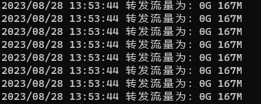

# 内网穿透工具

### 

### 1 分为服务端和客户端

```txt
1 服务端是部署在公网服务器上的，客户端是部署在本地机器上的，代码已经打包成 Window 和 Linux 可执行文件
```


### 2 服务端使用

#### 1 . linux 公网服务器要开放 3个端口

```go
const (
   ControlPort     = ":8080" //控制端口
   UserRequestPort = ":8081" //用户请求端口
   TunnelPort      = ":8082" //隧道端口
)
```

#### 2. Window使用

1. 双击 service.exe文件
2.  启动本地web服务器 （默认为80端口）
3. 双击 client.exe文件

出现


说明都已经启动成功

#### 3. linux上使用

1. 启动服务端   ./service
2. 启动客户端   ./client
3. 启动本地服务器 （自己的本地服务web服务器）

#### 4. 流量限制

在creatatlister.go文件中的Limit()函数

```go		

// n为 限制流量大小单位为m,net为控制连接的*net.TCPConn是为了控制

func (r *Reader) Limit(n int64, net *net.TCPConn) {
	fmt.Println("Limit启动", r.Size/(1024*1024), n)
	for {
		fmt.Println("已经使用流量数：", r.Size/(1024*1024)/2)
		time.Sleep(time.Second * 3)
		if r.Size/(1024*1024)/2 > n {
			_, err := net.Write([]byte("您已达到流量上限！\n"))
			if err != nil {
				log.Println("写入出错!" + err.Error())
			}
			//主动关闭连接
			net.Close()
			break
		}
	}

}
```


在client.go中controlsClient()函数，当服务端关闭时，阻塞读取会出现EOF的错误，退出主线程，协程也会退出，结束运行

```go
//连接控制端
func controlsClient() {
	//连接控制端
	tCPConn := utility.CreateConn(utility.ControlPort)
	//验证身份
	_, err := tCPConn.Write([]byte("hello,wrold"))
	if err != nil {
		log.Println(err)
	}
	log.Printf("[客户端连接成功::] %v", tCPConn.RemoteAddr().String())
	for {
		readString, err := bufio.NewReader(tCPConn).ReadString(byte('\n'))
		log.Println(readString)
		if err != nil {
			if err.Error() == "EOF" {
				log.Println("验证失败，服务器断开连接!")
				break
			}
			log.Println("读取失败！", err)
			break
		}
		if readString == utility.SendMessage {
			go getMessage()
		}
	}
}


func getMessage() {
	//连接隧道
	conn := utility.CreateConn(utility.TunnelPort)
	//连接本地服务器
	localhost := utility.CreateConn(utility.Localhost)

	r := &utility.Reader{
		Reader: localhost,
		Writer: localhost,
	}
	go io.Copy(r, conn)
	go io.Copy(conn, r)

}


func main() {
	//连接控制端
	controlsClient()

}
```


#### 5. 流量实时查看

提供了流量实时查看功能

```go
var (
	FlowRate int64 = 220 //M为单位，超过就会主动断开客户端连接
	size     int64
	k        bool = false
)

type Reader struct {
	io.Reader
	io.Writer
}

func (r *Reader) Read(p []byte) (n int, err error) {
	n, err = r.Reader.Read(p)
	if err != nil {
		return 0, err
	}
	atomic.AddInt64(&size, int64(n))
	r.log(size)
	return n, err
}

func (r *Reader) Write(p []byte) (n int, err error) {
	n, err = r.Writer.Write(p)
	if err != nil {
		return 0, err
	}
	return n, err
}

func (r *Reader) log(rd int64) {
	switch {
	case rd > 1024*((1024*1024)/2):
		log.Printf("转发流量为：%vG %vM", int(rd/(1024*1024)/2/1024), rd/(1024*1024)/2%1024)
	case rd > (1024*1024)/2:
		log.Printf("转发流量为：%vM", rd/(1024*1024)/2)
	}
}

func (r *Reader) Limit(n int64, net *net.TCPConn) {
	fmt.Println("Limit启动", size/(1024*1024), n)
	for {

		if size/(1024*1024)/2 > n {
			_, err := net.Write([]byte("您已达到流量上限！\n"))
			if err != nil {
				log.Println("写入出错!" + err.Error())
			}
			//主动关闭连接
			net.Close()
			k = true
		}
		if k {
			return
		}
		time.Sleep(time.Second * 3)
		fmt.Println("已经使用流量数：", size/(1024*1024)/2)
	}

}
```

在service.go文件中,当进行数据交换时，就会调用底层Read()方法

```go
func tunnelService() {
	con := utility.CreateLister(utility.TunnelPort)
	log.Printf("[隧道启动监听]%v", con.Addr().String())

	for {
		tunnelConn, err := con.AcceptTCP()
		if err != nil {
			log.Println(err)
		}
		r := &utility.Reader{
			Reader: tunnelConn,
			Writer: tunnelConn,
		}
		//流量限制,关闭隧道
		go r.Limit(utility.FlowRate, controlCon)
		go io.Copy(useConn, r)
		go io.Copy(r, useConn)

	}
}
```

效果




